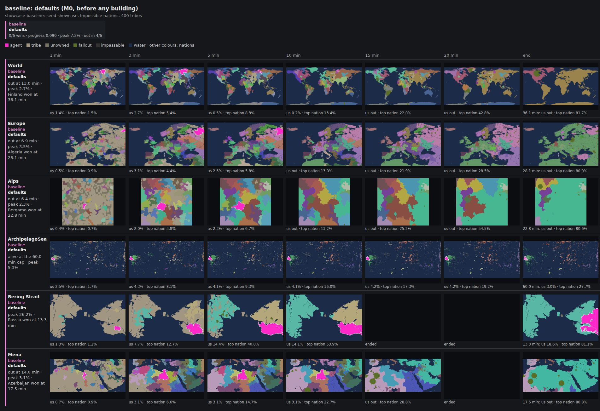

# 11 — Roadmap: beating Impossible nations on any map

> The plan of record for `src/agent/`. Written 2026-09-26 at commit `7b52b78`
> from the measurements in §11.1 and a reading of the Nation AI's source.
> Update the status column of §11.6 and append to
> [`12-ledger.md`](12-ledger.md) as work lands. Change the rest only when a
> measurement contradicts it.

## 11.1 Starting point

### The environment works (verified 2026-09-26)

| Check                                                   | Result                                                                                                                                            |
| ------------------------------------------------------- | ------------------------------------------------------------------------------------------------------------------------------------------------- |
| SessionStart hook                                       | Node 24.21.0, npm 12.1.0, `npm ci`, Playwright 1.56.1, all provisioned                                                                            |
| `npx vitest tests/agent --run`                          | 13/13 pass in ~4 s                                                                                                                                |
| `npm run arena`                                         | 4 games in parallel on 4 cores; 100–780 ticks/s per game (median 280); a played-out game takes ~48 s of wall time: **~4.8 games per wall minute** |
| Browser autopilot (`autopilot.mjs baseline Iceland 60`) | spawned unaided at tick 8, 7,911 tiles by tick 404, replica never behind, no divergence. Headless SwiftShader runs the client at ~0.7× real time  |
| Machine                                                 | 4 cores, 15 GB RAM                                                                                                                                |

### The baseline loses every game

Arena defaults (FFA solo, Impossible nations, 400 tribes, normal size), 24
random maps, seeds `plan-check` and `plan-bench`:

| agent                         | games | wins | eliminated | eliminated at (median) | peak land (mean / max) | placement (mean) |
| ----------------------------- | ----- | ---- | ---------- | ---------------------- | ---------------------- | ---------------- |
| `baseline`                    | 24    | 0    | 15         | 8.5 min                | 6.7% / 25.9%           | 8.8              |
| `idle` (spawns, then nothing) | 24    | 0    | 24         | 2.9 min                | 0%                     | 18.2             |

Against the leading nation, the baseline holds a median **3.8% vs 8.3%** of
the land at minute 3 and **2.9% vs 18.7%** at minute 10. It was never ahead
of the top nation at either checkpoint.

### The clock

With `--play-out`, **an Impossible nation took 80% and won all 40 games**:
median 22.9 game minutes, quartiles 20.6–27.6, fastest 10.2 (Bering Strait,
2 nations), slowest 57.8. No game reached the 60-minute cap.

So beating the Nation AI means **reaching 80% before the fastest nation
does, usually inside 15–25 game minutes**. Surviving is necessary and nowhere
near enough: the agent has to be the one that snowballs.

### What the games look like

[`progress/2026-09-26-m0-baseline.jpg`](progress/2026-09-26-m0-baseline.jpg)
is the baseline on the six `showcase` maps (§11.5), one row per game, frames
at minutes 1, 3, 5, 10, 15 and 20 and at the end. Every filed gallery is on
[OpenFront Arena Filmstrips](https://claude.ai/artifact/H6DNJr7YJfYYCaaiTXxrk4)
(private to the repository owner until shared).



- **The first minute is competitive**: level with or ahead of the top nation
  on 3 of 6 maps.
- **Free land is gone within a minute.** At minute 1 the 400 tribes hold
  37–96% of the land and unowned land is down to 0.5–5% (24–30% on Alps and
  ArchipelagoSea); by minute 3 the nations have eaten most tribes (Mena: 77%
  → 12% of the land). The baseline sits out that race and holds a half to two
  thirds of the leader's land at minute 3.
- **Then it stalls** (Mena: 3.1% at minutes 3, 5 and 10) and is eaten
  between minutes 6 and 14 on 4 of 6 maps.
- **On ArchipelagoSea it never leaves its home islands** (~4.2% from minute 3
  to minute 20), and no nation wins there either (27.7% at the 60-minute cap).
- **Nations nuke early**: the first fallout appears between minutes 4 and 7
  in every game.

## 11.2 The goal, made measurable

| Term     | Definition                                                                                                                                                                                                            |
| -------- | --------------------------------------------------------------------------------------------------------------------------------------------------------------------------------------------------------------------- |
| Win      | the arena records `win`: the agent held > 80% of non-fallout land (`WinCheckExecution`)                                                                                                                               |
| Setting  | arena defaults, the browser's solo mode against the strongest AI: FFA, Singleplayer, Impossible, the map's default nations, 400 tribes, normal size, 1 turn of latency, 10/s and 150/min intent limits, 60-minute cap |
| Any map  | the default pool: the 127 maps that have nations. Judged per map and per category, not only on average                                                                                                                |
| **Done** | `holdout` (§11.5): **≥ 90% wins, every map won in ≥ 2 of 3 seeds**, and the same agent plays unchanged as the browser autopilot                                                                                       |

Robustness to other lobbies (Hard, compact maps, fewer tribes, random spawn,
team modes) is a hardening pass after Done, not part of the goal.

## 11.3 Strategy: where an agent beats the Nation AI

The Nation AI is in this repo (`NationExecution.ts`, `nation/*.ts`,
`utils/AiAttackBehavior.ts`) and runs inside the deterministic simulation.
Its advantages are stats: ×1.25 `maxTroops`, ×1.05 regrowth, 31,250 starting
troops against our 25,000, zero latency. Ours are information and decisions:
every threshold it uses is readable state, we can act every tick while it
decides every 30–50, we may spawn anywhere, and in singleplayer `ctx.fork()`
predicts the future exactly (H10).

The hypotheses are ordered by when to test them. Each gives the mechanism and
the arena measurement that confirms or kills it. The rules quoted were checked
against source on 2026-09-26; conclusions drawn from them are **[DERIVED]**
and must be pinned by a scenario test before an agent depends on them.

**Pinned 2026-09-26.** Every hypothesis below was pinned by scenario tests
in `tests/agent/mechanics/`; [`13-mechanics.md`](13-mechanics.md) gives each
verdict (1 TRUE, 11 PARTIAL: the mechanics hold, the numbers or scope need
correcting), quotes each sentence here that is wrong or imprecise with its
correction (§3 there), and tabulates every constant an agent should use
(§5 there). Where this section and chapter 13 disagree, chapter 13 is right.
The largest surprises: a spawn sent at the agent's first call (turn 1)
lands before every nation; any player left at 100 tiles or fewer is annexed
whole by the loss of one tile, so a 1-troop attack kills a fresh tribe; a
single attack on a nation makes it Hostile for 1,001 ticks; and a
simulation bug duplicates a stack when a land attack inits exactly 20 ticks
after a `cancel_attack` on the same target (agents must avoid that tick).

Treat chapter 09 as a prior, not a spec. For example, its advice to run 2–3
parallel land attacks on free land buys nothing: a new land attack on the same
target absorbs every earlier one (`AttackExecution.init`).

**H1 — The spawn is the largest single decision.** In singleplayer the spawn
phase ends only when we spawn (`SpawnExecution.tick`) and nothing grows until
then, so the choice is untimed. Tribes are placed on the first tick; nations
hop within ±25 tiles of their manifest positions
(`NationExecution.randomSpawnLand`). Score candidates by the free land we win
in a race against every other spawn (multi-source flood fill on a coarse grid,
weighted by starting troops and terrain), plus coast on a large water body and
nearby tribes as food. Then check the top few by forking and simulating
60–90 s of expansion. _Measure:_ land share and rank among nations at
minute 3.

**H2 — The land grab is limited by troop income and frontage, not stack
size.** A free-land attack costs a flat 16/20/24 troops per plains, highland
or mountain tile. Its speed saturates at ~400 × tileCost troops (6,600 on
plains), beyond which only frontage adds speed (`Config.attackLogic`, §02.7).
Regrowth peaks with home troops at ~42% of the cap (§03), but every tile also
raises the cap, so the best home level is an empirical question. Nations keep
only 10–20% at home (`expandRatio`). A first sweep of the baseline (10% and 42%
home against its 20%) changed nothing measurable (ledger), so the home level
must be tuned with the rest of the expansion policy, not read off the formula.
Keep the free-land stack at saturation and send the surplus to separate
targets. _Measure:_ tiles at minutes 1, 2, 3.

**H3 — Tribes are the real land grab.** The M0 showcase shows free land gone
within a minute on most maps, with tribes holding most of the land at minute 1
and nations eating it by minute 3 (§11.1), so the race for tribe land in
minutes 1–3 decides the opening. There are 400 tribes with a third of the cap
and half the regrowth, and we take ×0.7 attacker losses against them (§02.1,
§03). Once free land runs out, Impossible nations attack up to 100 tribes at
once (`getBotAttackMaxParallelism`). Attacks on different targets never merge,
so run one per bordering tribe, sized to finish it, lowest density and widest
contact first, starting while free land remains. [DERIVED] A stack
of ≥ 1.22× the defender's troops takes player tiles ~1.6× faster per unit of
frontage than free land: `speedCost` bottoms out at a troop ratio of 0.82,
giving ~0.63 tiles per tick per border tile against free land's 0.4.
_Measure:_ land at minutes 5 and 10; share of tribe land we took.

**H4 — Be unattackable instead of defending.** In FFA an Impossible nation
sends at most `troops − 0.9 × (strongest non-allied, non-bot nearby player's
troops)` (`troopSendCap`). It refuses to send < 20% of the target's troops
unless it is itself under attack (`isAttackTooWeak`). While it borders free
land it launches no other land or boat attack (`maybeAttack`). [DERIVED] So
it cannot attack us by land while our **home** troops exceed ~0.91× its
troops, or by boat (it sends troops/5) while they exceed its troops. At 1.11×
even a nation under attack is capped at the size of the attack it faces. Also
stay out of `veryWeak` (< 15% of our cap), `juicy` (≤ 75% of its troops) and
`victim` (incoming > 50% of our troops). This puts a floor on attack sizing:
never send troops that drop home below the deterrence level of a nation that
can reach us. _Measure:_ nation attacks received; eliminations.

**H5 — Strike nations when they cannot answer.** Impossible's first strategy is
`retaliate`: it answers the largest incoming attack with `troops − reserveRatio
× cap` (reserve 30–40%), and that new attack cancels ours 1:1 when it is
created (`AttackExecution.init`). It skips its whole strategy list while it
borders free land or is below its reserve, and 90% of the time when below its
trigger of 50–60% of cap (`maybeAttack`, `attackBestTarget`). [DERIVED] So
strike when it is below its trigger (for instance just after it launched a big
attack), or with more troops than it holds above its reserve. Strike across
the widest shared border, with a stack of ≥ 1.67× its troops: the `troopRatio`
clamp at 0.6 makes that the cheapest per tile. Predict with
`config().attackLogic()` (a pure function) and confirm big strikes with a
fork. Finishing a player hands its unreached remnant to third parties
(`handleDeadDefender`, §02.4). _Measure:_ tiles gained per troop spent against
nations; how often they retaliate.

**H6 — Alliances on demand close fronts.** Impossible accepts a request from
anyone with 1.5× its troops, or with more troops and 1.5× its cap or tiles
(`isAlliancePartnerThreat`). It refuses traitors (90% of the time) and anyone
already allied with ≥ 25% of the non-bot players. Before tick 700 in
singleplayer it accepts 30% of other requests too (`isEarlygame`). Allies
cannot attack each other, and alliances lapse after 5 minutes at no cost.
[DERIVED] Fight one front at a time and ally the rest. Let alliances lapse
rather than break them: breaking makes us a traitor for 30 s (half attacker
losses and 25% faster attacks against us, −40 from neighbours). Use
`targetPlayer` to point allies at our target. _Measure:_ hostile fronts over
time; attacks received.

**H7 — Gold becomes cap.** Income is a flat 100/tick plus trade (§03). One city
level adds 250,000 to the cap, worth ~5,100 tiles mid-game. The first 125,000
gold arrives near tick 1,250: build a Port if a ≥ 300-tile route to a
tradeable foreign port exists (~13× income), else a City. Port levels are
superlinear, and Ports and Factories share one cost ladder. Attacking a nation
makes it embargo us for 5 minutes (`AttackExecution.init`), so our trade
partners are the nations we are not fighting. _Measure:_ gold per minute; cap
at minutes 5, 10, 15 against the top nation.

**H8 — Nukes arrive by minute 7, and the endgame has a MIRV problem.**
Ordinary nukes are a mid-game fact: fallout appeared between minutes 4 and 7
in every M0 showcase game. Nations nuke the largest incoming attacker first,
and an Impossible nation also nukes the land leader once the leader is more
than 10 points of land ahead of it, unless the two are allied
(`NationNukeBehavior.findFFACrownTarget`). So the moment we lead, nearly every
nation is aiming at us: SAMs and alliances (H6) belong in M3–M4, not only the
endgame. Impossible nations also MIRV anyone holding
≥ 40% of all land tiles (fallout included), and the city leader once it has
more than 8 cities and 1.15× the runner-up's (`NationMIRVBehavior`), if they
own a silo and can pay. A MIRV cannot be intercepted and costs 25M gold,
rising by 15M per launch (§05). Plan the run from 40% to 80%: impoverish or
kill the richest nations first, cross the gap fast, and build SAMs against
ordinary nukes. _Measure first:_ how often MIRVs are launched at
the agent in the arena, and at what land share.

**H9 — Water maps are boat maps.** 20 of the 127 maps are under 25% land.
Boats are free, 3 at a time, with no cooldown, and take their landing tile
without combat (§02.6); a later land attack on the same target absorbs the
beachhead. Use boats for free land and tribes on other landmasses during the
land grab, not only when landlocked. _Measure:_ results per map category.

**H10 — Lookahead is exact; spend it on large decisions.** Against nations in
singleplayer our intents are the only input from outside the simulation, and
snapshots restore byte-identically
(`tests/core/snapshot/FullGameSnapshot.test.ts`). A fork stepped with our
intents therefore _is_ the future, with two caveats. Intents sent but not yet
executed are not in the snapshot, so replay them into the fork's first step.
(At a latency above 1 tick each in-flight intent must go into the fork on the
turn it was queued for, not all into the first step: pinned by
`tests/agent/ForkFidelity.test.ts`.) And it is expensive: ~0.3–0.4 s to fork
plus 3–4 ms per tick on World mid-game, 6–9 ms early. Use it for the spawn (H1), strike go/no-go (H5) and alliance timing
(H6), never per tick.

## 11.4 Agent architecture

Build a new agent beside `baseline`, which stays unchanged as the reference.
That agent is `apex` (`src/agent/agents/apex/`, lib modules in `src/agent/lib/`),
built 2026-09-26 from a design spec judged over three independent designs;
its options, controllers and experiments are documented in `options.ts`.

```
src/agent/agents/<name>/
  index.ts        the Agent; each decision: perceive → safety → controllers → schedule
  options.ts      every tunable with its default, overridable as JSON (--agent <name>:{...})
  controllers/    spawn, expansion, tribes, defense, strike, diplomacy, economy, naval, nuclear
src/agent/lib/    shared read-only helpers (existing: Perception.ts, SpawnPlanner.ts)
  WorldModel.ts   one scan per decision: neighbours with contact, troops, density, cap
                  and ratios; free-land frontier; free land across water; game phase
  Models.ts       predictions straight from game.config(): attackLogic, maxTroops,
                  troopIncreaseRate, unit costs
  NationModel.ts  each nation's gates as predicates: borders free land? above reserve
                  or trigger? able to attack us (H4)? would accept an alliance (H6)?
                  MIRV risk (H8)?
  Scheduler.ts    proposed intents by priority under 10/s and 150/min, deduplicated
  Lookahead.ts    fork, replay pending intents, roll forward, score; within a budget
```

- **Rule-based controllers with model-based sizing and tuned parameters**, plus
  lookahead for a few decisions. Not reinforcement learning: at ~290 games an
  hour on 4 cores, against 0.2–4.2M land tiles of state, there is not enough
  simulation for it. Revisit only with a compact state abstraction and far more
  compute.
- Read `ctx.game`, act only through `ctx.send`, `--isolate` on every change.
  Call the `game.config()` formulas instead of copying them, so rule changes
  flow through.
- Budgets: p95 `tick()` < 5 ms on the largest maps (the browser worker is one
  thread); lookahead ≤ ~1 s per 10 s of game time, switchable off with an option
  for fast A/B runs.
- No DOM or Node APIs: the same code runs in the arena and in the browser
  worker.

## 11.5 Evaluation protocol

### Suites

Decisions need hundreds of paired games, so cheap suites screen and big ones
decide. Times are for one 4-core container:

| Suite      | Contents                                                | Games per entrant | Wall time per entrant | Use                                   |
| ---------- | ------------------------------------------------------- | ----------------- | --------------------- | ------------------------------------- |
| `smoke`    | 4 small maps, `--isolate --strict`, 10-minute cap       | 4                 | ~1 min                | every change                          |
| `showcase` | 6 fixed maps, played out, an image every minute (below) | 6                 | ~3 min                | every A/B and milestone: the pictures |
| `quick`    | 16 maps × 2 seeds (below)                               | 32                | ~4–13 min             | screening: drop clearly worse ideas   |
| `dev`      | all 127 maps × 2 seeds                                  | 254               | ~40–105 min           | the adoption test                     |
| `holdout`  | all 127 maps × 3 seeds never used in tuning             | 381               | ~60–160 min           | milestone sign-off and Done           |

`npm run arena -- --suite NAME` plays a suite (`src/agent/arena/Suites.ts`);
any flag given as well overrides the suite's. The low wall times are for an
agent that dies early, like the baseline (measured 2026-09-26: `quick` 4.2
min, `showcase` 2.8 min). An agent that survives keeps the game going until a
nation wins, ~92 s of wall time per game, which is the high end. Opening
work (M2) caps games with `--max-minutes 4`, which costs about a quarter.

`quick` maps, chosen to span the pool: World, Europe, Africa, NorthAmerica,
GiantWorldMap (107 nations), Alps and TheBox (all land, no ports),
MiddleEast (3.4M land tiles), ArchipelagoSea and Japan (6–8% land),
FourIslands, BeringStrait and YellowSea (2 and 8 nations, won by a nation in
10–21 and 15 min), Onion (smallest), MississippiRiver and Passage (400 tiles
wide). They play in a mixed order (World, ArchipelagoSea, Alps, BeringStrait,
Onion, Passage, Europe, FourIslands, Japan, TheBox, MississippiRiver, Africa,
YellowSea, MiddleEast, GiantWorldMap, NorthAmerica) because a tune's first
rounds play only the first games. `smoke` is Onion, ArchipelagoSea,
FourIslands and BeringStrait: small maps covering all land, islands and the
duel.

`showcase` maps, seed `showcase`: World, Europe, Alps, ArchipelagoSea,
BeringStrait, Mena. That covers continents with many nations, all land,
islands, a two-nation duel, and a crowded map where nations nuke early. It
plays the same games as the M0 ledger rows:

```bash
npm run arena -- --suite showcase --agent CHAMPION --agent CHALLENGER \
  --out arena-results/showcase-CHANGE
npm run arena:gallery -- arena-results/showcase-CHANGE
```

### Metrics

Primary: win rate with its Wilson interval. Until wins exist: `progress`
(peak land ÷ 0.8), land share and rank among nations at minutes 3, 10 and
15, eliminations, survival time. Once winning: time to win, against the minute
a nation wins the same game with `idle` in our seat.

Every game records `standings` at minutes 1, 2, 3, 5, 7, 10, 15, 20, 25, 30,
40, 50 and 60 (our share and rank, the median and top nation's share),
`received` (attacks by attacker type, nukes, who took our last tiles) and
`attacks`, our own attack log (target, troops sent and lost, tiles gained,
how it ended). Summaries turn them into the milestone rates: ≥ median and ≥
top nation at minute 3 (M2), eliminated before minute 20 and top 3 at minute
10 (M3), and the median minute of our wins (M5). An attack's `tilesGained`
counts tiles that moved from its target to us while it ran, so it includes
enclosed pockets and misses tiles taken from players we were not attacking
(`tilesUncredited` keeps the rest).

### Comparisons

The same seed gives every entrant the same maps and game IDs, so comparisons
are paired. `npm run arena:compare -- DIR_A DIR_B` (with `--entrant-a` and
`--entrant-b` when a run holds several entrants) pairs games by game ID and
reports discordant wins (sign test) and mean Δprogress, Δpeak land and
Δsurvival, each with a bootstrap 95% interval beside the better/worse split,
plus the milestone rates below, a per-category and per-map breakdown, the
games B lost most in (with the command that reruns each with pictures), and
a warning when either side ran on uncommitted or different code. Screen on `quick` and
stop if the challenger is clearly worse. Adopt a change only on `dev`: the
difference must be positive with the interval excluding zero, `smoke` must
pass, and the `showcase` gallery must show what the numbers claim. Confirm
milestone claims on `holdout`. Tuning touches only `quick` and `dev` seeds.

Why hundreds: in the first sweep, 20 paired games resolved only about ±0.04
in mean progress, and a +0.028 mean hid a change that was worse in 14 of 20
games (ledger). Intervals shrink with √n, to about ±0.011 at 254 paired games.
Once wins exist, a 10-point win-rate difference takes roughly 200–400 paired
games to show.

### Looking at the games

Numbers say whether a change helped; pictures say what it changed, and catch
what the metrics miss: an agent that takes land it cannot hold, never leaves
its island, or walks into nukes. Every A/B and every milestone renders the
`showcase` for both entrants on the same seed, in one gallery:

- `npm run arena:gallery -- <dir> [<dir>…]` writes `gallery.html`,
  `gallery.json` and `gallery.jpg`: one row per game and entrant, the
  territory at minutes 1, 3, 5, 10, 15 and 20 and at the end. The agent is
  magenta with a white outline, and each frame is captioned with its land share
  against the top nation's.
- Every row is labelled with what its run changed: only the options that differ
  between the entrants shown, with the value each ran and "(default)" where it
  was not overridden, e.g. `expandReserve 0.1` against
  `expandReserve 0.2 (default)`, led by the agent's name when agents differ.
  A key at the top gives each entrant's wins, progress, peak land and
  eliminations, and the default title names what was varied. Agents report
  their full options through `Agent.options`, so defaults can be shown.
- Look at the image before adopting (the Read tool displays images), write two
  or three observations into the ledger row, and send it to the user.
- When a big suite has a surprising loss, rerun that game with images
  (`--game N`, §11.7) and look at it.
- Each milestone also runs the browser autopilot once
  (`node .claude/skills/run-openfront/autopilot.mjs <agent> <map> 120`); its
  screenshots confirm the agent plays the real client the same way.

### Where the pictures live

Chat attachments disappear and containers are reclaimed, so the record lives
in the repository and on one page:

| What                                        | Size                                        | Kept                                                                                     |
| ------------------------------------------- | ------------------------------------------- | ---------------------------------------------------------------------------------------- |
| Territory frames (`images/`, one a minute)  | 10–40 KB each, ~3 MB per `showcase` entrant | never: any game replays exactly from its commit, entrant and seed                        |
| Screening galleries (`quick`, sweeps)       | JPEG, ~55 KB per row: ~0.35 MB per entrant  | in `arena-results/` only                                                                 |
| Galleries of adopted changes and milestones | same                                        | filed in `docs/progress/` with an entry in `galleries.json`, and shown on the page below |

File a gallery, then republish the page:

```bash
npm run arena:progress -- add arena-results/showcase-CHANGE --id CHANGE \
  --note "what the pictures show" --note "..."
npm run arena:progress -- page --out arena-results/progress/index.html
```

`add` copies the image to `docs/progress/DATE-CHANGE.jpg` and records the
title, what was varied, each entrant's label and numbers, the commit and the
notes. `page` writes the page and prints the files to publish beside it.
Publish it with the Artifact tool to the same URL,
[OpenFront Arena Filmstrips](https://claude.ai/artifact/H6DNJr7YJfYYCaaiTXxrk4),
passing only the new images in `files` (earlier ones are kept). A session
that did not create the page reads it first (`action: "read"`), then
publishes with its `url`. The page holds up to 511 files and 256 MB per
version, a few hundred galleries.

### The ledger

`arena-results/` is git-ignored and containers are reclaimed. Every adopted
change and milestone measurement appends a row to
[`12-ledger.md`](12-ledger.md).

### Compute

One container plays ~4.8 games per wall minute (~290 an hour), so `dev` costs
~50 min per entrant. Three things keep hundreds of games affordable:

1. **Reuse the champion's runs.** A seed replays exactly, so the champion's
   `dev` results stay valid until its code or the simulation changes; an A/B
   then only plays the challenger. Recording the commit in every run
   (§11.7 item 2) makes a stale one detectable.
2. **Screen on `quick` first**; only survivors go to `dev`.
3. **Shard big runs across cloud sessions** (`--shard i/n`): four sessions
   bring `dev` to a quarter of its time. `npm run arena:merge -- --out DIR
SHARD...` joins the shards into one run before comparing; `--range a:b`
   plays a slice of the game numbers the same way.

A 16-config sweep on `quick` takes ~1.8 h on one container.

## 11.6 Milestones

|     | Milestone            | Deliverables                                                                                 | Exit criterion                                                                               | Status                                                                                                                      |
| --- | -------------------- | -------------------------------------------------------------------------------------------- | -------------------------------------------------------------------------------------------- | --------------------------------------------------------------------------------------------------------------------------- |
| M0  | Ground truth         | environment verified, baseline measured, this plan, the ledger, the first `showcase` gallery | —                                                                                            | **done** 2026-09-26                                                                                                         |
| M1  | Measurement          | the §11.7 tooling; the baseline's `dev` run, kept for reuse                                  | one command per suite; paired report; fork-fidelity test green                               | done 2026-09-26: tooling, and the baseline's `dev@4` reference                                                              |
| M2  | Opening              | H1, H2, H3 in a new agent                                                                    | at minute 3, land ≥ the median nation's in ≥ 80% of `dev` games, ≥ the top nation's in ≥ 50% | `apex`, `dev@4`: ≥ median 94.9%, ≥ top 49.6% (one game short); spawn erasure lifts ≥ top to 65.6% on `quick`                |
| M3  | Survival             | H4, defensive H6, SAM cover against the early nukes (H8)                                     | eliminated before minute 20 in < 10% of `dev` games; top-3 land at minute 10 in ≥ 70%        | in progress: on `quick@20` top 3 at minute 10 in 58.1%, out before minute 20 in 12.5% (strikes + erasure); `dev@20` running |
| M4  | Conquest and economy | H5, H7                                                                                       | first wins; ≥ 25% on `dev`                                                                   |                                                                                                                             |
| M5  | Closing              | the MIRV threat (H8), a faster snowball                                                      | ≥ 60% on `dev`; median time to win under 22.9 min (the nations' median)                      |                                                                                                                             |
| M6  | Any map              | H9, the weakest categories fixed, big-map think time                                         | `dev` ≥ 80%, no category under 60%, no map lost on both seeds                                |                                                                                                                             |
| M7  | Browser              | the autopilot plays to a win on 3 maps including World, within budget                        | a recorded run per map, no divergence                                                        |                                                                                                                             |
| —   | **Done**             |                                                                                              | `holdout` ≥ 90%, every map won in ≥ 2 of 3 seeds                                             |                                                                                                                             |

Cross-cutting from M2 on: **tuning** (`npm run tune`, successive halving over
option sets on `quick`, finalists on `dev`) and **lookahead** (H10). Both are
adopted only through the same paired test.

## 11.7 Tooling (M1)

All of it landed on 2026-09-26, in `src/agent/arena/` unless noted, and
was checked end to end: the full smoke suite, its two shards merged, and
`--game` reruns all replay byte for byte, and the `plan-check` and M0
`showcase` ledger rows reproduce exactly.

| Tool                                               | What it does                                                                                                                                                                             |
| -------------------------------------------------- | ---------------------------------------------------------------------------------------------------------------------------------------------------------------------------------------- |
| `--each-map [--repeat R]`                          | every map in the pool once per repeat instead of random draws                                                                                                                            |
| `--suite NAME` (`Suites.ts`)                       | the §11.5 presets; explicit flags override them                                                                                                                                          |
| provenance                                         | `summary.json` records the commit, whether `src`, `resources` or the lockfile were dirty, whether the code changed during the run, the suite, the selection and the command line         |
| `--shard i/n`, `--range a:b`, `arena:merge`        | play part of a run's games (never changing which map or game ID a game gets) and join the parts into one run                                                                             |
| `arena:compare` (`Compare.ts`)                     | the paired report of §11.5 Comparisons; exits 1 when nothing pairs                                                                                                                       |
| `--game N`, `--from DIR`                           | rerun one game of a stored run, e.g. `--from DIR --game 7 --images --image-every 1 --verbose`; refuses if this checkout would give that game another map or game ID                      |
| standings, received, attack log (`Recorder.ts`)    | §11.5 Metrics; exact tile crediting from each tick's tile updates, under 1% of arena time                                                                                                |
| fork fidelity (`tests/agent/ForkFidelity.test.ts`) | a fork stepped with the real game's intents stays hash- and snapshot-identical: 600 ticks on Onion (through the spawn too) and 100 on World at tick 3,000 with nukes and ships in flight |
| fork time                                          | `stats.forkMs` apart from `thinkMs`; a World fork takes ~0.3–0.4 s at any tick, and a fork steps at 3–4 ms a tick mid-game, 6–9 early                                                    |
| `npm run tune` (`Tune.ts`)                         | successive halving over a JSON list of entrants on a suite's first games, reusing earlier rounds' games; writes `tune.md`                                                                |
| `arena:gallery`, `arena:progress`                  | the pictures (§11.5 Looking at the games)                                                                                                                                                |
| option check                                       | an agent option the agent does not have is refused before any game plays, so an A/B cannot measure a typo                                                                                |

Known limits: an attack's `tilesGained` is attribution by target (§11.5
Metrics); `--from` replays the stored command line against today's code and
warns when that differs from the run's commit; an agent exception or a
replica divergence under `--strict`/`--isolate` makes the arena exit 2.

## 11.8 Risks

| Risk                                                                           | Mitigation                                                                                                                            |
| ------------------------------------------------------------------------------ | ------------------------------------------------------------------------------------------------------------------------------------- |
| Chapters 00–09 were written by a model; chapter 09 already has one wrong claim | pin every mechanic an agent relies on with a scenario test against the real simulation, in the style of `tests/__snapshots__/Attack*` |
| Hundreds of games per decision on 4 cores                                      | reuse the champion's runs, screen on `quick`, shard across sessions (§11.5 Compute), shaped metrics before wins exist                 |
| The numbers improve while the play does not (a metric being gamed)             | the `showcase` gallery at every A/B, looked at before adopting                                                                        |
| Overfitting the tuning seeds                                                   | tune only on `quick` and `dev`; sign off on `holdout`                                                                                 |
| Lookahead is too slow on big maps or in the browser                            | a budget per game minute, an off switch, fork time measured separately (§11.7 item 8)                                                 |
| The 150/min intent limit caps micromanagement                                  | the scheduler prioritises; top-ups of a free-land attack merge into one anyway                                                        |
| Upstream merges change the mechanics                                           | after each upstream merge, rerun `dev` and the golden tests; the mechanics docs are pinned to `22722df`                               |
| An agent mutates the game and desyncs the browser replica                      | `--isolate` in `smoke`; agents never call a mutating method                                                                           |

## 11.9 How a session works

1. Read `CLAUDE.md`, this file and the tail of `12-ledger.md`. Take the first
   open item of the earliest unfinished milestone.
2. Branch from `main`: one milestone step per branch and PR.
3. Pin the mechanic you rely on with a test, then build the change as a new
   agent or behind an option.
4. Run `npx vitest tests/agent --run`, `npm run lint` and `smoke`. Then
   screen on `quick` against the current best agent, and if the challenger is
   not clearly worse, run `dev`, reusing the champion's stored run.
5. Render the `showcase` gallery for both, look at it, and note what changed.
6. Adopt only on a clear paired gain that the pictures agree with: append the
   ledger row with those notes, file the gallery and republish the page (§11.5,
   Where the pictures live), update §11.6, commit, push, and send the gallery
   to the user.
7. Long runs (`dev`, `holdout`, sweeps) go in the background or out to shard
   sessions; commit their summaries to the ledger before the container is
   reclaimed.
